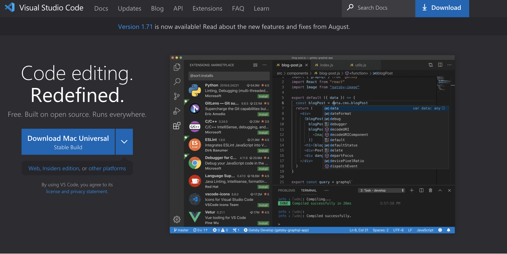
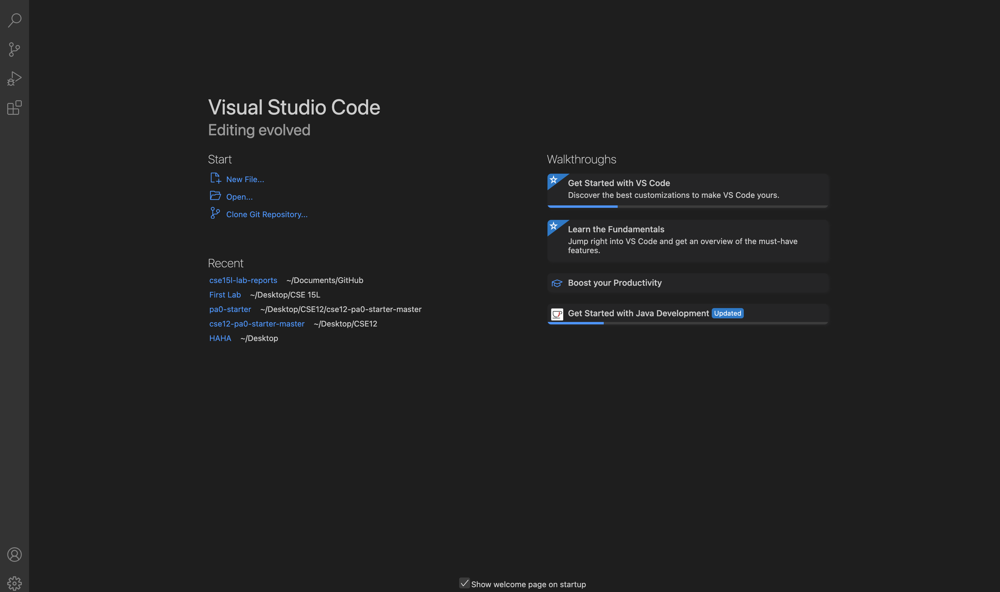
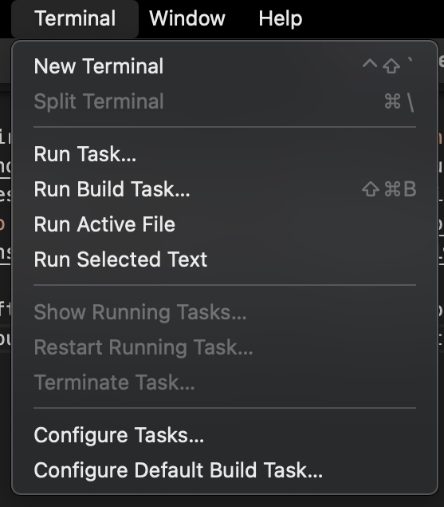
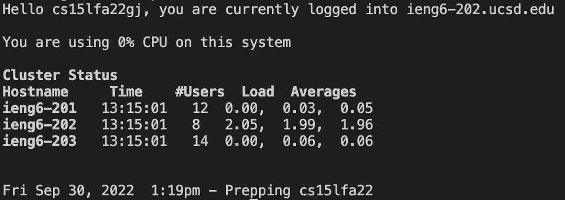
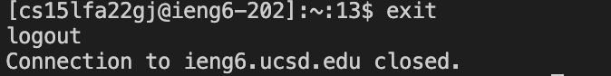
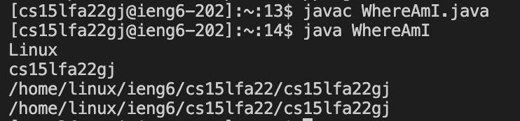
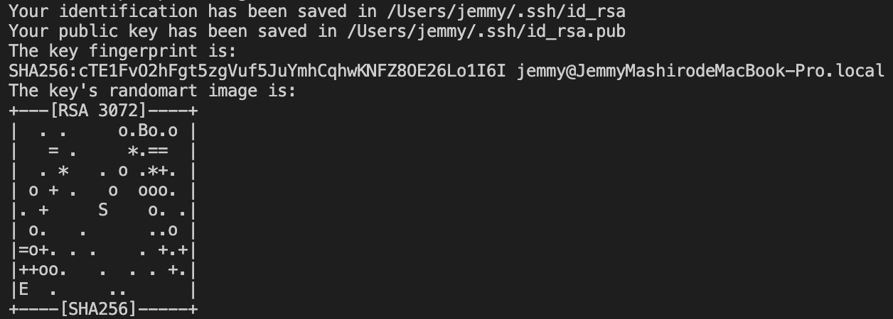

# Lab Report 1 - Remote Access and Filesystem
*Table of Contents*
- Installing Visiual Studio Code
- Remotely Connecting
- Trying Some Commands
- Moving Files with `scp`
- Setting an SSH Key
- Optimizing Remote Running

**Please follow the directions carefully and don't jump steps**

---

## 1. Installing VScode
Visit Visual Stuido Code(https://code.visualstudio.com/) website and follow the insturction in the website to download the corresponding VScode on your computer.



If you install the right version according to your operating system, you should see this page showed up on the vscode.



After you seeing this page, it means you have succefully downloaded the VScode onto your computer. 

---

## 2. Remotely Connecting
Now time to connect to the server. 

First of all, look up you account in [this](https://sdacs.ucsd.edu/~icc/index.php) website. You'll need to set up your password throught the resetting the password. There are help information in [[TUTORIAL] How to Reset your Password](https://docs.google.com/document/d/1hs7CyQeh-MdUfM9uv99i8tqfneos6Y8bDU0uhn1wqho/edit).

After finish setting up your account, open a terminal in your VScode, you can find it by click on "Terminal" tab and click "New Terminal".



Then type in 
```
$ ssh cs15lfa22$$@ieng6.ucsd.edu
```
 into the terminal but **replacing** the $$ with your last two letter in your account. 

Now, you should see something like 
```
The authenticity of host 'ieng6.ucsd.edu (128.54.70.227)' can't be established.
RSA key fingerprint is SHA256:ksruYwhnYH+sySHnHAtLUHngrPEyZTDl/1x99wUQcec.
Are you sure you want to continue connecting (yes/no/[fingerprint])? 
```
And of course, we have to say `yes` to finish setting up. 

Then it will ask you for your password, **it is normal that your typing did not reflect on the screen, just press enter when you are done typing**, if you are having trouble logging in, refer back to [[TUTORIAL] How to Reset your Password](https://docs.google.com/document/d/1hs7CyQeh-MdUfM9uv99i8tqfneos6Y8bDU0uhn1wqho/edit).
If you tuped your password wrong/mistyped your password, dont worry! The same thing will pops up and ask your password again!

If everything goes right, you should see this page.



**CONGRATULATION!!!** you just connect yourself into the server.

---

## 3. Trying Some Commands

after connecting to the server, you can try these commands by simply typing into the terminal. Try them out yourself and see if you can understand what these commands do. 

```
cd
ls
pwd
mkdir
cp
cat
```
Hope you found out what some of them does!
- The `cd` let you move between directories
- The `ls` shows what files is in the current directory.
- The `pwd` prints your current directory.
- The `mkdir` let users to create new directory.
- The `cp` stands for copy, so it copy files into a new file.
- The `cat` allow users to view the contents of the file.  


In this picture, I move to the folder on my desktop called "CSE 15L". Remember when there is space between your folder, you need to use quotaion mark around it. 


You can also run these commands in your own computer as well, simply type in `exit` in the terminal and you will be log out. 



---

## 4. Moving Files with `scp`
Now we are trying to upload a file you have and run it on the server. But before we doing this, we need a file to upload. 

So let's create a file called `WhereAmI.java` in your computer and paste the following code into the file. 
```
class WhereAmI {
  public static void main(String[] args) {
    System.out.println(System.getProperty("os.name"));
    System.out.println(System.getProperty("user.name"));
    System.out.println(System.getProperty("user.home"));
    System.out.println(System.getProperty("user.dir"));
  }
}
```
Let's try if this code works on your computer, in the terminal, `cp` to the address of this file and run the following command and see if everything works.
```
javac WhereAmI.java
java WhereAmI
```

Now let's try to move this file into the server. Run this command below

```
scp WhereAmI.java cs15lfa22zz@ieng6.ucsd.edu:~/
```

And it will ask you for your password. Now try to log into the server, yeah, you will need to retype the password again if you did it already for uploading the file. 

Now, after doing everything right, if you run the following command in the terminal after connecting to the server, 
```
javac WhereAmI.java
java WhereAmI
```
you should see something similar to the following.



**Great!**, you have now know how to upload a file in your computer into the server. 

---

## 5. Setting an SSH Key
Now, I know you are probably feeling frustrating about typing your password over and over again, especially when you can't see it. Here is something they may help. You can **SKIP** typing the password!

Remember to follow carefully, cause it will be tricky. First, type the following into the termianl **without** connecting to the server.
```
ssh-keygen
```
Now, you should see something pops out, you can press `enter` to set it to default or type in an address. After following the instruction it pops up(pressing `enter` three times), you will get two addreess of your password. One for the private key and one for the public key. Copy that **public** one down, you will need it soon. 



Now, log into the server, and when you are on the server. Type the following command
```
$ mkdir .ssh
$ exit
```

after getting back to your own computer, type the following to upload your public key to the server.

```
scp //Users/jemmy/.ssh/id_rsa.pub cs15lfa22$$@ieng6.ucsd.edu:~/.ssh/authorized_keys
```

you should replace the first part of the command with the address of your public key you copied down before, and replace **$$** with your own user name. 

Now after typing in the password and finish uploading, if everything goes right, when you try to log in now, you can skip typing in your password now. **YEAH!!!**

---

Optimizing Remote Running

You can save a lot of time by learning this technique, we can combine multiple command into to one to make it clean and save more time. 
```
ssh cs15lfa22@ieng6.ucsd.edu "ls"
```
You can combine the command together by putting the command in to quote. 


In the picture, it shows me directly what's in my directory instead of me trying to first log in, and type in `ls` for the same output. 

---
# THANK YOU
## By Mingjie Chen
