# Lab Report 2 - Servers and Bugs
## Part 1 - Simplest Search Engine from week 2
*My Code*
```
import java.io.IOException;
import java.net.URI;
import java.util.ArrayList;

class Handler implements URLHandler {
    // The one bit of state on the server: a number that will be manipulated by
    // various requests.
    int num = 0;
    ArrayList<String> list = new ArrayList<String>();
    public String handleRequest(URI url) {
        
        if (url.getPath().contains("/add")) {
            String[] parameters = url.getQuery().split("=");
            if (parameters[0].equals("s")) {
                list.add(parameters[1]);
                return "added";
            } else{
                return "not added";
            }
        }
        else {
            if (url.getPath().contains("/search")) {
                String output = "";
                String[] para = url.getQuery().split("=");
                if (para[0].equals("s")) {
                    String check = para[1];
                    for(int i = 0; i < list.size(); i++){
                        if(list.get(i).contains(check)){
                            output = output + ", " + list.get(i);
                        }
                    }
                }
                if(output != ""){
                    return output.substring(1).strip();
                } else{
                    return "Nothing Found";
                }
            } else{
                return "Try to Add or Search Something!";
            } 
        }
    }
}

class NumberServer {
    public static void main(String[] args) throws IOException {
        if(args.length == 0){
            System.out.println("Missing port number! Try any number between 1024 to 49151");
            return;
        }

        int port = Integer.parseInt(args[0]);

        Server.start(port, new Handler());
    }
}
```
To start it off, when opening the page, you will see this.

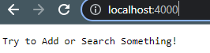

In this page, it is a default page I set up when loading the website up. It will call the method `handleRequest` which will identify what the path/query are, in this case, not path or query is showing, it will skip to all the way down, return `Try to Add or Search Something!`. There are no values relevant to this argument since it is skipping everything. However, before every `if` statement, I am creating a new ArrayList to store everything in. A new ArrayList called `list` is created, and it is currently empty, as times goes, more Strings will be stored in this.
- `ArrayList<String> list = new ArrayList<String>();`
- list = {}
---
Next, adding the first item.

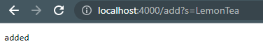

Here in the picture, you can see that it response from the website is `added`. So this will also call the method `handleRequest`. However, in this case, there is something in the path as well as the query. So first, it path `contains /add`, so it will go into the first if statement. The array `parameters` is created and `split` the path by the "=" sign. So the query here is `s=LemonTea`, 
- `parameters[0]` will be "s"
- `parameters[1]` will be "LemonTea"
- Something like `["s", "LemonTea"]`

After splitting the queries, it will go into another `if` statement, since `parameters[0]` is equal to "s", so now we can add the `parameters[1]` into the list we created before.
- `list.add(parameters[1]);`
- list = {"LemonTea"}

Then it will tell the users the element is "added" like shown in the picture, if it fail the `if` statement, it will instead tell the user "not added". 

---
Now, let's add on more items into our list.

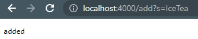

Here in the picture, you can see again that it response from the website is `added`, which mean it adds another item to the list succefully. Again, it call the method `handleRequest`. I will not be go overing all the details like the previous adding Lemon Tea, but I will show how different value changed. When it pass the first `if` statement, the parameters is being created again, so the previous parameters is not there anymore. So like before, the queries is being `split` by the "=" sign.
- `parameters[0]` will be "s"
- `parameters[1]` will be "IceTea"
- Something like `["s", "IceTea"]`

Again after splitting the queries, it again go into the next `if` statement, since the `parameters[0]` is again equal to "s". So, the new element is being added to the list.

- `list.add(parameters[1]);`
- list = {"LemonTea", "IceTea"}

Again, it will display "added" in the screen. 

---

Finally, let's try to find the element we store. In the following picture, we'are trying to find element that contains "Lemon", which will only show "LemonTea" but not "IceTea".

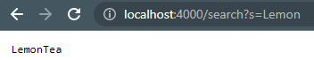

So, it will first call the method `handleRequest` since it will the method that deal with all the URLs. When it get the link, it will get the path, which is `/search`, so it will skip the first `if` statement and goes into the `else` statement. In the `else` statement, it will go into the first `if` statement, since the path did contains `/search`. If it did not pass the `if` statement, it will keep saying "Try to Add or Search Something!". After going into the `if` statement, it will create a String called `output` which will be returned in the end, I am storing all the value that matches the search in the output.

- `String output = "";`
- output = ""

Now, again, similarly, we are spliting the queries `s=Lemon` based on "=" sign.

- `String[] para = url.getQuery().split("=");`
- `para[0]` will be "s"
- `para[1]` will be Lemon

We see that the `para[0]` did equals to "s", so we go into another `if` statement. Now, I am creating a new String called check, this not necessary but I like making things looks clearer. And I am setting this to the Key word I am searching, and in this case, Lemon.

- `String check = para[1];`
- check = "Lemon"

Now, we are heading into the for loop, it is looping from `i = 0` to `i < list.size` by increasing 1 each time it looped. In this case,

- list = {"LemonTea", "IceTea"}
- `list.size` = 2

So first loop, `i=0`, we see that `list.get(i)` will gives us "LemonTea", since it is the 0th element in our list. And comparing this with `check` which is "Lemon", "LemonTea" did contains "Lemon", so we are adding this into our output.

- `output = output + ", " + list.get(i);`
- output = ", LemonTea"

Now, to the second loop, `i=1`, we see that it will get "IceTea", which when comparing to `check`, it does not contains "Lemon", so it will nto be added to the output. 

Finally, outside of the loop, we will be checking if the `output` is still blank, if it is still blank, we will tell the users there is "Nothing Found", but if there is something in the `output`, we will first remove the starting "," and also removing any leading or trailing space by `split`.

- output = ", LemonTea"
- `output.substring(1).strip();`
- output = "LemonTea"

Now, we will return this to the users, and this is what you see on the screen. 

---

## Part 2 : Bugs
**File 1** : ArrayTests.java

I am focusing on the `Reversed` method in the ArrayTest.java file. 

- Failure-inducing input (the code of the test), is `{1,2,3}`

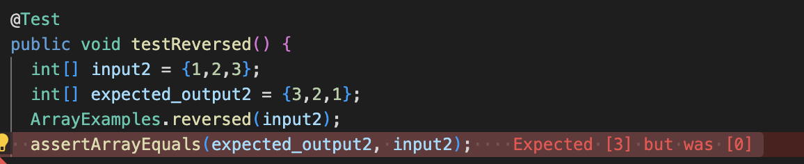

- The symptom is that it returns an array with all 0, when it should returns an array that reversed the orignial array. So the expected output should be `{3,2,1}`.

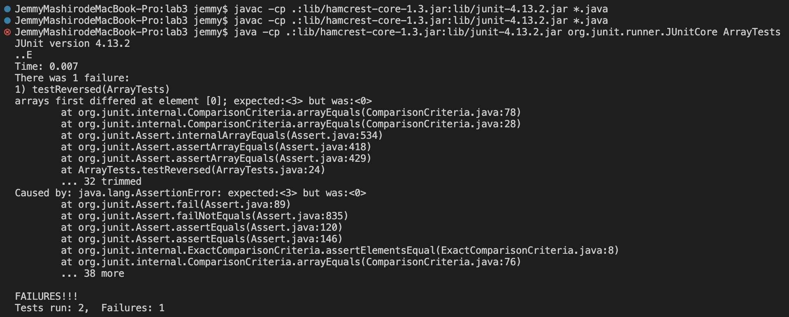
- The bug was that the code is making changes on the input array itself but not the new array it created. In order to fix it, simply change the left side of the equal sign to be the array that just creted, and assign the old array to the new array in reverse index. 

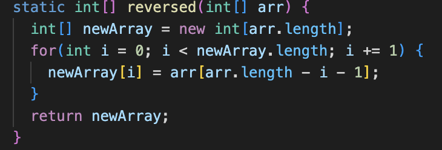
- So the bug was that the method was changing the input array instead of newly created array, when we create a new array, it will have value 0 in it, so when you assign the array with all 0s to the input array, and eventually return that, you will get an array with all 0s in it.

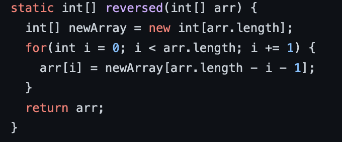

---

**File 2** : ListExamples.java

I am focusing on the `filter` method in the ListExamples.java file. 
In this file, the class `ListExamples` uses the interface `StringChecker` which will return a boolean if the input string mathes the "rule". So I created a very simply checker shown below. 
```
interface StringChecker { 
  boolean checkString(String s);
}

class ContainsA implements StringChecker{

  @Override
  public boolean checkString(String s) {
    if(s.contains("a")){
      return true;
    }else{
      return false;
    }
  }
  
}
```

So this will help explain why my input should get certain expected output.

- Failure-inducing input (the code of the test), is a new ArrayList input, which is euqal to `{"apple", "banna", "lemon", "pear"}"`

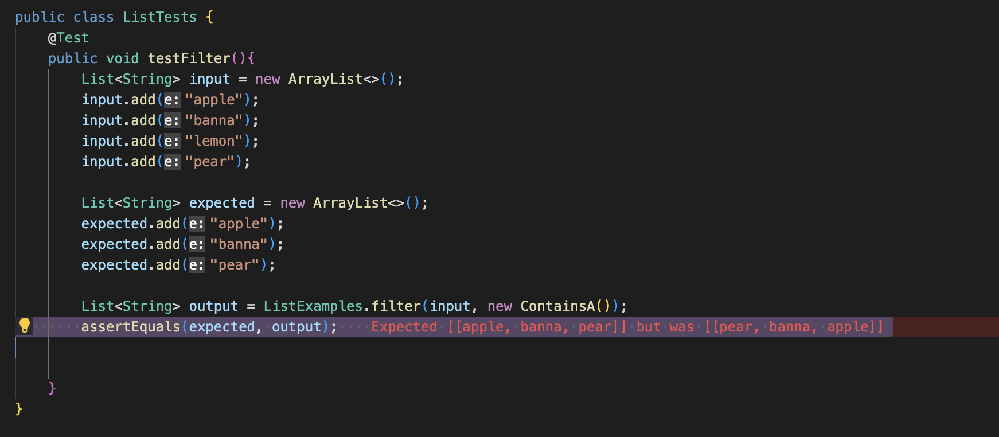

- The symptom is that it returns an array with all the element that is being filtered, but the order is wrong, it is adding apple element in reverse order. The expected output should be `{"apple", "banna", "pear"}`, but the actual output is `{"pear", "banna", "apple"}`.

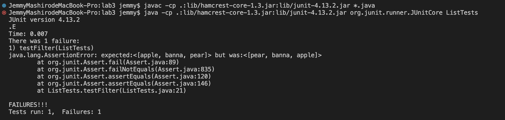

- The bug is that it is adding all the new element to the first element, so it is making a order reversed. 

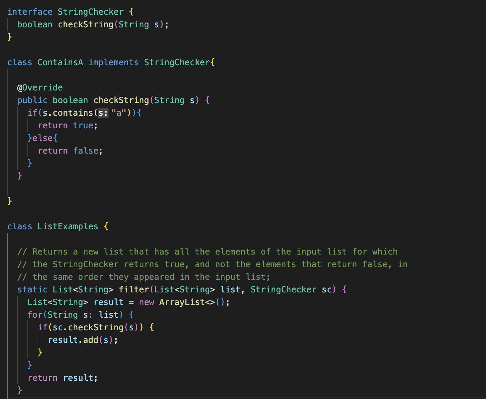

- The bug was that the line `result.add(0,s)` is adding all the element in the front of the list, in other word, it is prepending the element. This will cause the list to be in reversed order as shown in the symptom. 

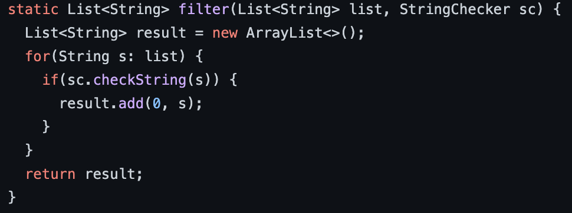
