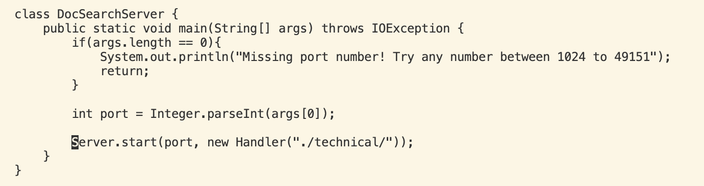
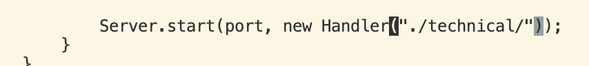
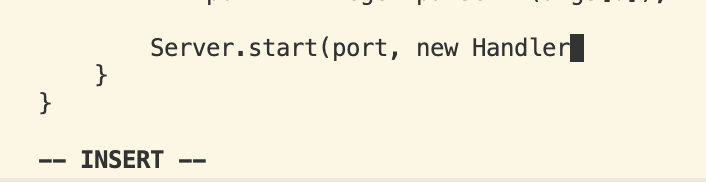
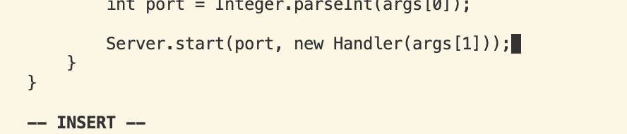
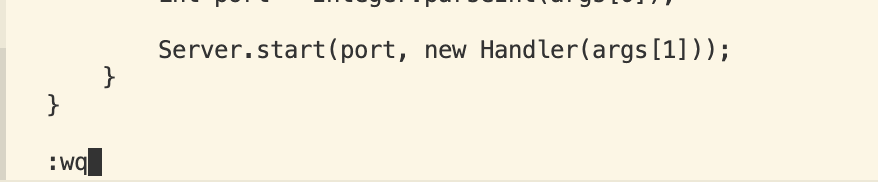

# Lab Report 4 - Vim
## Part 1 - Vim with less than 30 keys pressed

*Task: Changing the main method to take a command-line argument*

**Sequecne of keys to Press**

```
74gg8wd3wa(args[1]));<ESC>:wq <Enter>
```
Total Key Pressed : 4 + 2 + 3 + 1 + 11 + 5 = 26

**What Each Step Does**

`74gg`

This takes you to the 74th line in the file, and put your cursor in the front of the line.

`8w`



This will take you 8 words foward, so your cursor will be at the end of 8th word.

`d3w`

This will delete the next 3 words, so that we can replace `("./technical/")` with a command line argument input.

`a`



This will take us to insert mode, note that `a` will move your cursor to the **right** of your current place, which is different from `i` which is inserting word to the **left** of your current cursor place.

`(args[1]));`



Now simply typing in the command line argument, since `args[0]` is our port number, so we should put `args[1]` as our input. 

`<ESC>:wq <Enter>`


Now, all we need to do is quit insert mode by pressing `<ESC>` and type in `:wq` and press `<Enter>` to save all the edits we did with vim. 

---
## Part 2 - Comparing two editing strategies

Time for performing task in VSCode and `scp` to the server, and run `bash test.sh`

48 Seconds


Time for performing task in Terminal and run `bash test.sh`

37 Seconds

**Difficulties**: I am still a little unsed to vim, but I can tell Vim is way more efficient if dealing with running on server. 

*Which of these two styles would you prefer using if you had to work on a program that you were running remotely, and why?*

If I am working remotely, I will choose the second method, which is using vim and edit on the server. Because when working on a project, there is usually more than 1 files, and it takes a while if the file is large. That will lost time. Also, it is hard to send all the files in the right directory when there is a lot of file in the remote server. Thus, if working on remote directly, we don't need to worry about `scp` and having wrong directory. 

*What about the project or task might factor into your decision one way or another? (If nothing would affect your decision, say so and why!)*

If the file is only consisting one file, and it is relative small, I would not mind both. For now, I am more used to using VScode to make all the edits, so it is more convenient for me, but if I am used to using Vim, I will do every edit with Vim. On the other hand, if there are multiple file, and some file even require files in the server that employee can not download it, we can only choose to work on the server using Vim. Unless we can not test if our code works in local. 


