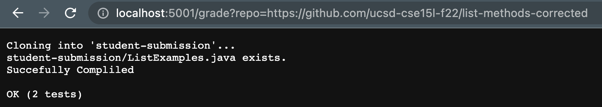
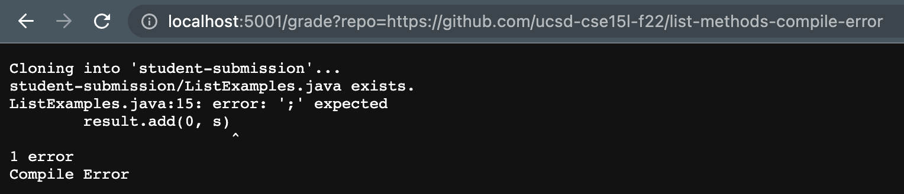
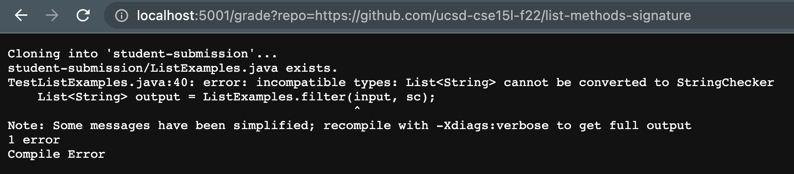

# Lab Report 4 - List Grader
## Part 1 - Grade.sh & Three Screenshots

```
set -e

rm -rf student-submission
git clone $1 student-submission

FILE=student-submission/ListExamples.java
if [ -f "$FILE" ]; then
    echo "$FILE exists."
else 
    echo "$FILE does notexists."
    exit
fi

rm -rf student-test
mkdir student-test
cp TestListExamples.java student-test
cp student-submission/ListExamples.java student-test
cp lib/hamcrest-core-1.3.jar student-test
cp lib/junit-4.13.2.jar student-test

cd student-test
set +e
javac -cp .:hamcrest-core-1.3.jar:junit-4.13.2.jar *.java
if [[ $? -eq 0 ]]; then 
    echo "Succefully Compliled"
else
    echo "Compile Error"
    exit   
fi

java -cp .:hamcrest-core-1.3.jar:junit-4.13.2.jar org.junit.runner.JUnitCore TestListExamples > output.txt

tail -3 output.txt > report.txt
cat report.txt
```

1st Repository:

https://github.com/ucsd-cse15l-f22/list-methods-corrected



2nd Repository:

https://github.com/ucsd-cse15l-f22/list-methods-compile-error



3rd Repository:

https://github.com/ucsd-cse15l-f22/list-methods-signature



---

## Part 2 - Tracing Grade.sh
Repository I am tracing: 

https://github.com/ucsd-cse15l-f22/list-methods-signature

---

 Command 

 ``Set -e`` 

Std output & Std error

**None**


 Return Code

 ``0``

 ---

  Command 

 ``rm -rf student-submission`` 

Standard Output

**None**

Standard Error

**None**

 Return Code

 ``0``

 ---

 Command 

 ``git clone $1 student-submission`` 

Standard Output

``Cloning into 'student-submission'...
remote: Enumerating objects: 3, done.
remote: Counting objects: 100% (3/3), done.
remote: Compressing objects: 100% (2/2), done.
remote: Total 3 (delta 0), reused 3 (delta 0), pack-reused 0
Receiving objects: 100% (3/3), done.``

Standard Error

**None**

 Return Code

 ``0``

 ---

  Command 

 ``if [ -f "$FILE" ]; then`` 

Standard Output

**None**

Standard Error

**None**

 Return Code

 ``0``

If Statement

The condition will met since it will check whether the it has the file that is equals to the `$File` which I set in the previous line, shown below:

`FILE=student-submission/ListExamples.java`

Since the repository contains this file, then it should be able to run the lateral commands. 

 ---

Command 

 ``echo "$FILE exists."`` 

Standard Output

``student-submission/ListExamples.java exists.``

Standard Error

**None**

 Return Code

 ``0``

 ---

 Command 

 ```
 else 
    echo "$FILE does notexists."
    exit"
``` 

Standard Output

``student-submission/ListExamples.java does not exists.``

Standard Error

**None**

 Return Code

 ``0``


If Statement

This will not run since we run the above statement, and this is in an `else` statement which will only run if we fail to met the above `if` statement.

 ---

 Command 

 ```
rm -rf student-test
mkdir student-test
cp TestListExamples.java student-test
cp student-submission/ListExamples.java student-test
cp lib/hamcrest-core-1.3.jar student-test
cp lib/junit-4.13.2.jar student-test
 ```

Standard Output

**None**

Standard Error

**None**

 Return Code

 ``0``

 ---

Command 

 ```
cd student-test
set +e
 ```

Standard Output

**None**

Standard Error

**None**

 Return Code

 ``0``

 ---

 Command 

 ``
javac -cp .:hamcrest-core-1.3.jar:junit-4.13.2.jar *.java
 ``

Standard Output

**None**

Standard Error

```
TestListExamples.java:40: error: incompatible types: List<String> cannot be converted to StringChecker
    List<String> output = ListExamples.filter(input, sc);
                                              ^
Note: Some messages have been simplified; recompile with -Xdiags:verbose to get full output
1 error
```

 Return Code

 ``1``

 ---

  Command 

```
if [[ $? -eq 0 ]]; then 
    echo "Succefully Compliled"
``` 

Standard Output

``Succefully Compiled``

Standard Error

**None**

 Return Code

 ``0``

If Statement

It will not run since the `if` condition will not be passed, since we saw in the last command, that out return code is `1`, which will not met this condition. 

 ---

  ---

  Command 

```
else
    echo "Compile Error"
    exit   
fi
``` 

Standard Output

``Compile Error``

Standard Error

**None**

 Return Code

 ``0``

If Statement

Since we did not met the condition above, we will run this `else` statement instead, and this will run the `echo` command and exit the program 

 ---

 ```
 java -cp .:hamcrest-core-1.3.jar:junit-4.13.2.jar org.junit.runner.JUnitCore TestListExamples > output.txt
tail -3 output.txt > report.txt
cat report.txt
```

We will not run any of these since we have an early exit above.


